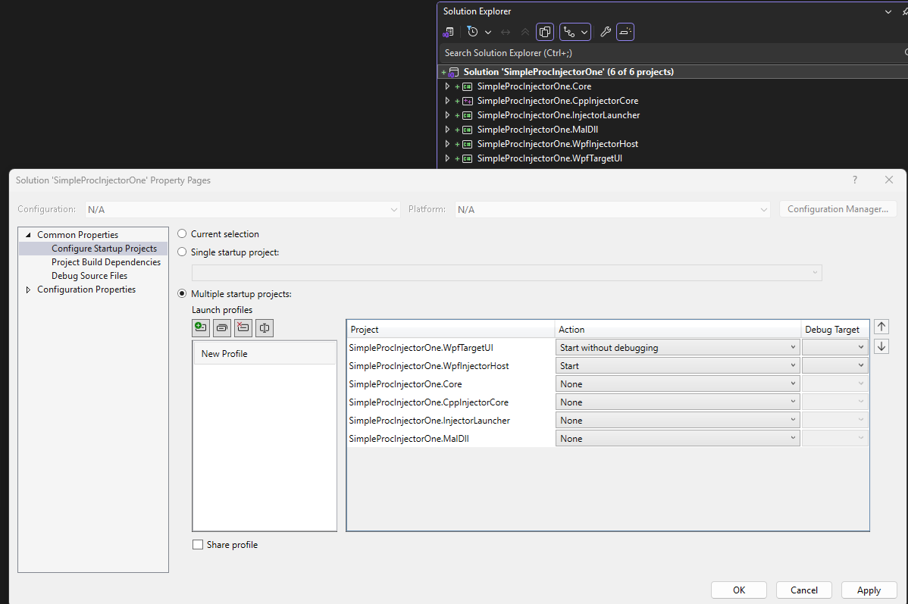

## Notes

1. To run, do the following.



2. This example does not use a temp Settings file. Instead, it uses a json file.

```cs
string transientSettingsJson = this.GetTransientSettingsJson(targetHwnd);

var injectorData = new InjectorData
{
    FullAssemblyPath = snoopAssemblyPath,
    ClassName = className,
    MethodName = methodInfo.Name,
    SettingsJson = transientSettingsJson
};

Injector.InjectIntoProcess(processWrapper, injectorData);
```

3. 
