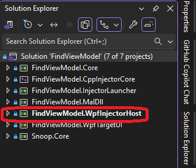
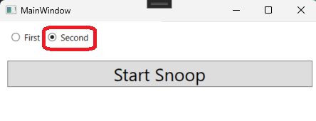

## Notes

1. This example is based on BasicProcInjector.

2. This example creates and uses a temp file at Temp folder location `C:\Users\YourUserName\AppData\Local\Temp`

3. Find the following. `transientSettingsFile`

```cs
string transientSettingsFile = this.GetTransientSettingsFile(FindViewModelStartTargetNew.SnoopUI, targetHwnd);

var injectorData = new InjectorData
{
    FullAssemblyPath = snoopAssemblyPath,
    ClassName = className,
    MethodName = methodInfo.Name,
    SettingsFile = transientSettingsFile
};

Injector.InjectIntoProcess(processWrapper, injectorData);
```


4. To run, do the following.



5. Here we go.




